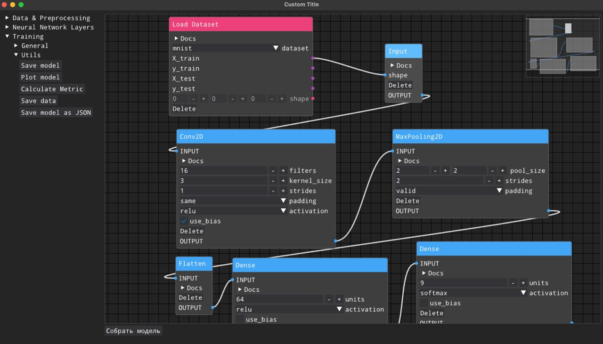

# graphNet

<p align="center">
  <a href="#english">English</a> •
  <a href="#русский">Русский</a>
</p>

---

<a name="english"></a>
# graphNet (English)

[](https://www.python.org)
[](LICENSE)

**graphNet** is a cross-platform desktop application designed for visual prototyping and construction of neural network architectures. Built on top of the fast and lightweight **Dear PyGui** library, it provides an intuitive node-graph interface where users can easily create layers, link them to define the data flow, and configure parameters for each individual node.

---

## 📝 About the Project

Developing deep learning models often requires writing boilerplate code to define complex, multi-branch architectures. **graphNet** aims to simplify this process by providing a visual workspace where you can:
* **Assemble architectures interactively:** Add layers (nodes) such as Linear, Conv2D, Pooling, or Activation functions, and connect them with edges.
* **Configure hyperparameters:** Adjust weights, kernel sizes, strides, activation functions, and other layer parameters directly inside the GUI.
* **Visualize the flow:** Easily trace how data moves through complex topologies, including multi-input or multi-output systems.

### 🖼️ Screenshots & Media

#### Main Workspace

*Figure 1: Visual workspace with nodes and connections representing a neural network.*

#### Video Demonstration
Below is a video demonstrating the workflow, from placing the first node to running the application:

<video src="Assets/IMG_3070.mov" controls width="100%"></video>

---

## 🚀 How to Run

You can run **graphNet** either as a standalone pre-compiled application or directly from the source code.

### Option 1. Run via Executable (.EXE)
This is the easiest way for Windows users who do not want to install Python or set up a command-line environment.

1. Go to the **Releases** section on the right side of this GitHub repository.
2. Download the latest `graphNet.zip` (or `graphNet.exe`) archive.
3. Extract the archive to any folder on your computer.
4. Double-click **`graphNet.exe`** to launch the application.

---

### Option 2. Run via Console (using `uv`)
If you want to run the project from source, it is highly recommended to use [uv](https://github.com/astral-sh/uv), a fast Python package installer and resolver.

#### 1. Install `uv`
* **Windows:**
  ```powershell
  winget install astral-sh.uv
  ```
* **macOS:**
  ```bash
  brew install uv
  ```
* **Linux:**
  ```bash
  pip install uv
  ```

#### 2. Run the application
Once `uv` is installed, navigate to the project directory and execute:
```bash
uv run main.py
```
*`uv` will automatically create a virtual environment, install the correct Python version (>=3.12.0), install all required dependencies (Dear PyGui, NumPy, Pillow, PyDot, TensorFlow), and launch the app*

---

## 🧪 Testing & Coverage

The project uses **pytest** for automated testing. Thanks to the configuration in `pyproject.toml`, you do not need to manually configure `PYTHONPATH` or test directories.

### 1. Running Automated Tests
To run all tests in the repository, simply execute:
```bash
uv run pytest
```

### 2. Calculating Code Coverage
To measure how much of the codebase is covered by your tests, first install the `coverage` tool as a development dependency:
```bash
uv add --dev coverage
```
Then run the tests under coverage tracking and generate a report:
```bash
uv run coverage run -m pytest
uv run coverage report
```

---

## 🤝 Contribution & Joining the Team

We welcome contributions of all kinds — from fixing typos in the documentation to implementing complex features. Feel free to open issues or submit Pull Requests!

### 🚀 Want to Join Our Team?
We are actively looking for passionate developers to join the **graphNet** core team. If you want to work with us, the process is simple:
1. **Contact us:** Reach out to **[@jezvGG](https://t.me/jezvGG)** on Telegram and tell us a bit about your experience and interest in the project.
2. **Interview:** Have a brief technical interview with the team to discuss your background and align goals.
3. **Test Task:** Complete a small, hands-on test assignment to showcase your coding skills.

---

## 🛠️ Building from Source (.EXE compilation)

If you want to compile your own `.exe` file after making changes to the source code, you can use the configured Makefile:

```bash
make build
```
*The compiled executable will be placed in the `dist/` directory with all assets and configs embedded.*

---

<a name="русский"></a>
# graphNet (Русский)

[](https://www.python.org)
[](LICENSE)

**graphNet** — это кроссплатформенное десктопное приложение на Python, разработанное для визуального проектирования и конструирования архитектур нейронных сетей. Благодаря быстрому и легковесному GUI-фреймворку **Dear PyGui**, приложение предоставляет интуитивный интерфейс в виде графа, где пользователи могут добавлять слои (узлы), связывать их для определения потока данных и настраивать параметры каждого элемента.

---

## 📝 О проекте

Проектирование архитектур глубокого обучения часто требует написания шаблонного кода, особенно для сложных сетей с ветвлением. **graphNet** призван решить эту проблему, предоставляя графическую рабочую область, где вы можете:
* **Интерактивно собирать архитектуру:** Добавлять слои (линейные, сверточные, пулинг, функции активации) и связывать их ребрами.
* **Конфигурировать параметры:** Настраивать размерности, шаги (stride), ядра свертки и другие параметры слоев напрямую через графический интерфейс.
* **Визуализировать потоки данных:** Наглядно видеть, как данные проходят через сложные топологии, включая системы с несколькими входами и выходами.

### 🖼️ Скриншоты и медиа-материалы

#### Главное рабочее пространство

*Рисунок 1: Визуальный редактор с нодами и связями, представляющими нейросеть.*

#### Видеодемонстрация работы
Ниже представлено видео, демонстрирующее процесс создания сети от первой ноды до запуска:

<video src="Assets/IMG_3070.mov" controls width="100%"></video>

---

## 🚀 Как запустить

Вы можете запустить **graphNet** либо как готовую автономную программу, либо из исходного кода через консоль.

### Вариант 1. Запуск через готовый файл (.EXE)
Этот способ наиболее удобен для пользователей Windows, которым не требуется изменять код или настраивать окружение Python.

1. Перейдите в раздел **Releases** (Релизы) в правой части страницы этого репозитория.
2. Скачайте последнюю версию архива `graphNet.zip` (или файл `graphNet.exe`).
3. Распакуйте архив в любую удобную папку на компьютере.
4. Запустите файл **`graphNet.exe`** двойным кликом.

---

### Вариант 2. Запуск через консоль (с использованием `uv`)
Если вы хотите запустить проект из исходного кода, рекомендуется использовать [uv](https://github.com/astral-sh/uv) — быстрый инструмент для управления проектами на Python.

#### 1. Установите `uv`
* **Windows:**
  ```powershell
  winget install astral-sh.uv
  ```
* **macOS:**
  ```bash
  brew install uv
  ```
* **Linux:**
  ```bash
  pip install uv
  ```

#### 2. Запустите приложение
После установки `uv` перейдите в терминале в корневую директорию проекта и выполните команду:
```bash
uv run main.py
```
*`uv` автоматически создаст виртуальное окружение, загрузит необходимую версию Python (>=3.12.0), установит зависимости (Dear PyGui, NumPy, Pillow, PyDot, TensorFlow) и запустит проект.*

---

## 🧪 Тестирование и покрытие (Coverage)

Для автоматического тестирования в проекте используется фреймворк **pytest**. Благодаря встроенной конфигурации в `pyproject.toml`, вам больше не нужно вручную настраивать переменную `PYTHONPATH` и пути к тестам перед запуском.

### 1. Запуск автотестов
Для запуска всех тестов в репозитории выполните команду:
```bash
uv run pytest
```

### 2. Расчёт покрытия кода (Coverage)
Чтобы измерить процент покрытия исходного кода тестами, сначала установите пакет `coverage` в зависимости для разработки:
```bash
uv add --dev coverage
```
Затем запустите тесты под контролем утилиты coverage и выведите отчет в консоль:
```bash
uv run coverage run -m pytest
uv run coverage report
```

---

## 🤝 Участие в разработке (Contribution)

Мы рады любому вкладу в развитие **graphNet** — от исправления опечаток в документации до реализации новых архитектурных слоев. Смело создавайте тикеты (Issues) или отправляйте Pull Requests!

### 🚀 Хотите попасть к нам в команду?
Мы всегда в поиске увлеченных разработчиков, готовых развивать проект вместе с нами. Чтобы присоединиться к основной команде, вам нужно:
1. **Написать нам:** Свяжитесь напрямую через Telegram с **[@jezvGG](https://t.me/jezvGG)** и коротко расскажите о своем опыте.
2. **Пройти собеседование:** Пройти небольшое техническое собеседование с командой, где мы познакомимся и обсудим общие задачи.
3. **Решить тестовое:** Выполнить небольшое практическое тестовое задание для демонстрации ваших навыков.

---

## 🛠️ Сборка исполняемого файла (.EXE из исходников)

Если вы внесли изменения в код и хотите собрать собственный `.exe` файл, воспользуйтесь настроенным `Makefile`:

```bash
make build
```
*Собранное приложение со всеми ресурсами и конфигурациями логгера будет сохранено в папку `dist/`.*
```